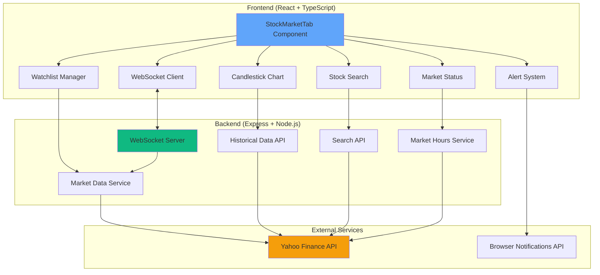

# Design Document: Live Stock Market Tab

## Overview

The Live Stock Market Tab is a comprehensive real-time market monitoring feature that integrates into the existing Market Intelligence financial dashboard. This feature provides traders and investors with real-time stock quotes, interactive candlestick charts, market alerts, watchlist management, and advanced market visualization tools.

### Design Goals

1. **Real-time Performance**: Deliver market data updates within 1-5 seconds of market changes
2. **Scalability**: Support monitoring of 50+ stocks simultaneously without performance degradation
3. **User Experience**: Provide intuitive, responsive interfaces that work across desktop and mobile devices
4. **Integration**: Seamlessly integrate with existing backend services and design system
5. **Reliability**: Implement robust error handling and graceful degradation when services are unavailable

### Key Technical Decisions

**Real-time Data Strategy**: WebSocket-first with polling fallback
- Primary: WebSocket connection for sub-second updates during market hours
- Fallback: 10-second polling when WebSocket unavailable
- Rationale: WebSocket provides lowest latency for real-time updates while polling ensures reliability

**Charting Library**: Lightweight Charts by TradingView
- Modern, performant candlestick chart library
- Built-in support for real-time updates, zoom, pan, and tooltips
- Small bundle size (~200KB) with excellent TypeScript support
- Rationale: Best balance of features, performance, and developer experience

**State Management**: React Context + Local State
- Global context for WebSocket connection and market status
- Component-level state for UI interactions
- LocalStorage for persistence (watchlist, alerts, preferences)
- Rationale: Appropriate complexity for feature scope, avoids Redux overhead

**Backend Architecture**: Extend existing Express server
- New endpoints for historical data, search, and market hours
- Reuse existing Yahoo Finance integration in market-data.ts
- Add WebSocket server for real-time price streaming
- Rationale: Leverages existing infrastructure, minimizes new dependencies

## Architecture

### System Architecture Diagram



### Data Flow

**Real-time Price Updates**:
```
Yahoo Finance → Market Data Service → WebSocket Server → WebSocket Client → UI Components
```

**Historical Data Requests**:
```
UI Component → Historical Data API → Yahoo Finance → Cache → Response → Chart Component
```

**Stock Search**:
```
User Input → Debounced Search → Search API → Symbol Database → Autocomplete Results
```

### Component Hierarchy

```
StockMarketTab/
├── StockMarketHeader
│   ├── MarketStatusIndicator
│   └── StockSearch
├── IndexDisplay
│   └── IndexCard (multiple)
├── ChartSection
│   ├── TimeframeSelector
│   ├── CandlestickChart
│   └── VolumeChart
├── WatchlistPanel
│   ├── WatchlistItem (multiple)
│   └── AddStockButton
├── AlertPanel
│   ├── AlertList
│   └── CreateAlertForm
├── HeatmapView
│   └── HeatmapCell (multiple)
└── ComparisonView
    ├── ComparisonChart
    └── MetricsTable
```

## Components and Interfaces

### Frontend Components

#### 1. StockMarketTab (Main Container)

**Purpose**: Root component that orchestrates all sub-components and manages global state

**Props**: None (route-based)

**State**:
```typescript
interface StockMarketState {
  activeView: 'overview' | 'chart' | 'heatmap' | 'comparison'
  selectedSymbol: string | null
  watchlist: string[]
  alerts: PriceAlert[]
  marketStatus: MarketStatus
}
```

**Key Responsibilities**:
- Initialize WebSocket connection
- Manage view routing
- Coordinate data fetching
- Handle error boundaries

#### 2. IndexDisplay

**Purpose**: Display major market indexes with real-time updates

**Props**:
```typescript
interface IndexDisplayProps {
  indexes: MarketIndex[]
  loading: boolean
  onIndexClick: (symbol: string) => void
}

interface MarketIndex {
  symbol: string
  name: string
  value: number
  change: number
  changePercent: number
  lastUpdate: string
}
```

**Features**:
- Grid layout (responsive: 3 columns desktop, 2 mobile)
- Color-coded changes (green/red)
- Click to view detailed chart
- Auto-refresh every 5 seconds

#### 3. CandlestickChart

**Purpose**: Interactive financial chart with OHLC data

**Props**:
```typescript
interface CandlestickChartProps {
  symbol: string
  timeframe: Timeframe
  data: CandleData[]
  onTimeframeChange: (tf: Timeframe) => void
  realTimeUpdate?: boolean
}

interface CandleData {
  time: number // Unix timestamp
  open: number
  high: number
  low: number
  close: number
  volume: number
}

type Timeframe = '1m' | '5m' | '15m' | '1h' | '1d' | '5d' | '1M' | '3M' | '6M' | '1Y' | '5Y'
```

**Features**:
- Lightweight Charts integration
- Real-time candle updates
- Zoom and pan controls
- Crosshair with OHLC tooltip
- Volume bars below price chart
- Export to CSV functionality

#### 4. StockSearch

**Purpose**: Autocomplete search for stocks and indexes

**Props**:
```typescript
interface StockSearchProps {
  onSelect: (symbol: string) => void
  placeholder?: string
}

interface SearchResult {
  symbol: string
  name: string
  exchange: string
  type: 'stock' | 'index' | 'etf'
}
```

**Features**:
- 300ms debounced input
- Fuzzy matching on symbol and name
- Keyboard navigation (arrow keys, enter)
- Recent searches (localStorage)
- Clear button

#### 5. WatchlistPanel

**Purpose**: User-curated list of stocks with live prices

**Props**:
```typescript
interface WatchlistPanelProps {
  symbols: string[]
  prices: Map<string, StockQuote>
  onAdd: (symbol: string) => void
  onRemove: (symbol: string) => void
  onReorder: (from: number, to: number) => void
}
```

**Features**:
- Drag-and-drop reordering
- Real-time price updates
- Add via search
- Remove with confirmation
- Persist to localStorage (max 50 items)
- Compact and expanded views

#### 6. AlertPanel

**Purpose**: Create and manage price alerts

**Props**:
```typescript
interface AlertPanelProps {
  alerts: PriceAlert[]
  onCreate: (alert: PriceAlert) => void
  onDelete: (id: string) => void
  onEdit: (id: string, alert: PriceAlert) => void
}

interface PriceAlert {
  id: string
  symbol: string
  condition: 'above' | 'below'
  targetPrice: number
  enabled: boolean
  createdAt: string
  triggeredAt?: string
}
```

**Features**:
- Form to create new alerts
- List of active alerts
- Enable/disable toggle
- Auto-disable after trigger
- Browser notification integration
- Persist to localStorage (max 20 alerts)

#### 7. MarketStatusIndicator

**Purpose**: Show market open/closed status with countdown

**Props**:
```typescript
interface MarketStatusIndicatorProps {
  market: 'US' | 'EU' | 'ASIA'
  status: MarketSessionStatus
  nextEvent: MarketEvent
}

interface MarketSessionStatus {
  isOpen: boolean
  session: 'regular' | 'pre-market' | 'after-hours' | 'closed'
}

interface MarketEvent {
  type: 'open' | 'close'
  time: Date
  countdown: string
}
```

**Features**:
- Color-coded status (green/red/yellow)
- Countdown timer
- Timezone-aware calculations
- Multiple market support

#### 8. HeatmapView

**Purpose**: Treemap visualization of market sectors

**Props**:
```typescript
interface HeatmapViewProps {
  data: HeatmapData[]
  onCellClick: (symbol: string) => void
}

interface HeatmapData {
  symbol: string
  name: string
  sector: string
  marketCap: number
  changePercent: number
}
```

**Features**:
- D3.js treemap layout
- Size by market cap
  Color by performance
- Sector grouping
- Hover tooltips
- Click to view details

#### 9. ComparisonView

**Purpose**: Side-by-side comparison of multiple securities

**Props**:
```typescript
interface ComparisonViewProps {
  symbols: string[]
  timeframe: Timeframe
  onAddSymbol: (symbol: string) => void
  onRemoveSymbol: (symbol: string) => void
}
```

**Features**:
- Normalized percentage chart
- Metrics comparison table
- Add/remove securities (max 4)
- Toggle absolute vs relative view
- Export comparison data

### Backend Services

#### 1. WebSocket Server

**Purpose**: Stream real-time price updates to connected clients

**Implementation**:
```typescript
class StockWebSocketServer {
  private wss: WebSocketServer
  private subscriptions: Map<string, Set<WebSocket>>
  private updateInterval: NodeJS.Timer
  
  constructor(server: http.Server)
  subscribe(ws: WebSocket, symbols: string[]): void
  unsubscribe(ws: WebSocket, symbols: string[]): void
  broadcast(symbol: string, quote: StockQuote): void
  startPriceUpdates(): void
  stopPriceUpdates(): void
}
```

**Protocol**:
```typescript
// Client → Server
type WSClientMessage = 
  | { type: 'subscribe', symbols: string[] }
  | { type: 'unsubscribe', symbols: string[] }
  | { type: 'ping' }

// Server → Client
type WSServerMessage =
  | { type: 'quote', data: StockQuote }
  | { type: 'error', message: string }
  | { type: 'pong' }
```

**Features**:
- Per-symbol subscription management
- Automatic cleanup on disconnect
- Heartbeat ping/pong (30s interval)
- Rate limiting (max 100 symbols per client)
- Error handling and reconnection logic

#### 2. Historical Data API

**Endpoints**:

```typescript
// GET /api/stock/history/:symbol
interface HistoricalDataRequest {
  symbol: string
  interval: '1m' | '5m' | '15m' | '1h' | '1d'
  range: '1d' | '5d' | '1mo' | '3mo' | '6mo' | '1y' | '5y'
}

interface HistoricalDataResponse {
  symbol: string
  data: CandleData[]
  meta: {
    currency: string
    exchangeName: string
    instrumentType: string
  }
}
```

**Caching Strategy**:
- 5-minute cache for intraday data (1m, 5m, 15m, 1h)
- 1-hour cache for daily data
- LRU cache with 1000 entry limit
- Cache key: `${symbol}:${interval}:${range}`

#### 3. Stock Search API

**Endpoints**:

```typescript
// GET /api/stock/search?q=:query
interface SearchRequest {
  q: string
  limit?: number // default 10
  types?: ('stock' | 'index' | 'etf')[] // default all
}

interface SearchResponse {
  results: SearchResult[]
  query: string
}
```

**Implementation**:
- Pre-built symbol database (JSON file)
- Fuzzy matching using Fuse.js
- Search on symbol and company name
- Filter by type and exchange
- Response time < 50ms

#### 4. Market Hours Service

**Purpose**: Calculate market session times and status

**Implementation**:
```typescript
class MarketHoursService {
  getMarketStatus(market: string, timezone: string): MarketSessionStatus
  getNextMarketEvent(market: string, timezone: string): MarketEvent
  isMarketOpen(market: string): boolean
  getMarketHours(market: string): MarketHours
}

interface MarketHours {
  market: string
  timezone: string
  regularHours: { open: string, close: string }
  preMarket?: { open: string, close: string }
  afterHours?: { open: string, close: string }
  holidays: string[]
}
```

**Market Definitions**:
- US: NYSE/NASDAQ (9:30 AM - 4:00 PM ET, Mon-Fri)
- EU: Euronext (9:00 AM - 5:30 PM CET, Mon-Fri)
- ASIA: TSE (9:00 AM - 3:00 PM JST, Mon-Fri)

**Holiday Handling**:
- Static holiday list for 2025-2026
- Check against current date
- Return "closed" status on holidays

## Data Models

### Frontend Models

```typescript
// Stock Quote
interface StockQuote {
  symbol: string
  price: number
  change: number
  changePercent: number
  volume: number
  marketCap?: number
  timestamp: string
}

// Candle Data
interface CandleData {
  time: number // Unix timestamp
  open: number
  high: number
  low: number
  close: number
  volume: number
}

// Price Alert
interface PriceAlert {
  id: string
  symbol: string
  condition: 'above' | 'below'
  targetPrice: number
  enabled: boolean
  createdAt: string
  triggeredAt?: string
}

// Market Status
interface MarketStatus {
  market: string
  isOpen: boolean
  session: 'regular' | 'pre-market' | 'after-hours' | 'closed'
  nextEvent: {
    type: 'open' | 'close'
    time: Date
  }
}

// Stock Metrics
interface StockMetrics {
  symbol: string
  fiftyTwoWeekHigh: number
  fiftyTwoWeekLow: number
  ytdChange: number
  avgVolume30d: number
  peRatio?: number
  marketCap?: number
  dividendYield?: number
  beta?: number
}

// Watchlist Item
interface WatchlistItem {
  symbol: string
  addedAt: string
  order: number
}

// Heatmap Data
interface HeatmapData {
  symbol: string
  name: string
  sector: string
  marketCap: number
  changePercent: number
  volume: number
}
```

### Backend Models

```typescript
// Yahoo Finance Response (simplified)
interface YahooQuoteResponse {
  chart: {
    result: [{
      meta: {
        symbol: string
        regularMarketPrice: number
        previousClose: number
        currency: string
        exchangeName: string
      }
      timestamp: number[]
      indicators: {
        quote: [{
          open: number[]
          high: number[]
          low: number[]
          close: number[]
          volume: number[]
        }]
      }
    }]
  }
}

// Search Database Entry
interface SymbolEntry {
  symbol: string
  name: string
  exchange: string
  type: 'stock' | 'index' | 'etf'
  sector?: string
  country: string
}

// WebSocket Subscription
interface Subscription {
  clientId: string
  symbols: Set<string>
  lastPing: number
}
```

### LocalStorage Schema

```typescript
// Key: 'stock-watchlist'
interface WatchlistStorage {
  version: 1
  symbols: string[]
  lastUpdated: string
}

// Key: 'stock-alerts'
interface AlertsStorage {
  version: 1
  alerts: PriceAlert[]
  lastUpdated: string
}

// Key: 'stock-preferences'
interface PreferencesStorage {
  version: 1
  defaultTimeframe: Timeframe
  defaultView: 'overview' | 'chart' | 'heatmap' | 'comparison'
  chartTheme: 'dark' | 'light'
  enableNotifications: boolean
}

// Key: 'stock-recent-searches'
interface RecentSearchesStorage {
  version: 1
  searches: string[]
  maxItems: 10
}
```


## Correctness Properties

*A property is a characteristic or behavior that should hold true across all valid executions of a system—essentially, a formal statement about what the system should do. Properties serve as the bridge between human-readable specifications and machine-verifiable correctness guarantees.*

### Property 1: Navigation to Stock Market View

*For any* initial application route, when the Stock_Market_Tab is clicked, the application should navigate to the stock market view route.

**Validates: Requirements 1.2**

### Property 2: Active Tab Styling

*For any* navigation tab, when that tab is active, it should display active state styling (background color, border, or indicator).

**Validates: Requirements 1.4**

### Property 3: Index Display Completeness

*For any* index displayed in the Index_Display, it should show the current value, absolute change, and percentage change.

**Validates: Requirements 2.2**

### Property 4: Value Change Color Coding

*For any* displayed value with a change indicator, positive changes should be displayed in green, negative changes in red, and neutral/zero changes in a neutral color.

**Validates: Requirements 2.3, 2.4**

### Property 5: Index Update Latency

*For any* market data change event, the Index_Display should reflect the updated values within 5 seconds.

**Validates: Requirements 2.5**

### Property 6: WebSocket Connection During Market Hours

*For any* active market session, the Quote_Service should use WebSocket connection for streaming price updates.

**Validates: Requirements 3.1**

### Property 7: Price Update Latency

*For any* new price data received, the Price_Ticker should update the displayed price within 1 second.

**Validates: Requirements 3.2**

### Property 8: WebSocket Reconnection Behavior

*For any* WebSocket connection loss, the application should attempt reconnection at 5-second intervals.

**Validates: Requirements 3.3**

### Property 9: Last Update Timestamp Display

*For any* application state where market data has been successfully received, a timestamp showing the last update time should be displayed.

**Validates: Requirements 3.5**

### Property 10: Market Event Notifications

*For any* major market opening or closing event, the Market_Alert_System should display a notification containing the market name and event time.

**Validates: Requirements 4.1, 4.2**

### Property 11: Timezone-Aware Market Times

*For any* user timezone setting, market session times should be correctly converted and displayed in the user's local timezone.

**Validates: Requirements 4.4**

### Property 12: Browser Notification Integration

*For any* market event when notification permissions are granted, the Market_Alert_System should send a browser notification.

**Validates: Requirements 4.5**

### Property 13: Market Closed Countdown

*For any* time when markets are closed, the Market_Alert_System should display a countdown timer showing time until the next market open, and this countdown should decrease over time.

**Validates: Requirements 4.6**


### Property 14: Chart Availability for Indexes

*For any* index displayed in the Index_Display, a candlestick chart view should be available via a toggle or click action.

**Validates: Requirements 5.1**

### Property 15: OHLC Data Completeness

*For any* candle displayed in the Candlestick_Chart, it should contain Open, High, Low, and Close values.

**Validates: Requirements 5.2**

### Property 16: Real-Time Candle Updates

*For any* new price data received during an active candle period, the current candle should update to reflect the new data.

**Validates: Requirements 5.4**

### Property 17: Chart Interactivity

*For any* Candlestick_Chart, zoom and pan interactions should be functional and responsive.

**Validates: Requirements 5.6**

### Property 18: Candle Hover Tooltip

*For any* candle in the Candlestick_Chart, hovering over it should display a tooltip containing OHLC values and timestamp.

**Validates: Requirements 5.7**

### Property 19: Candle Color Coding

*For any* candle displayed, if close > open it should be green, if close < open it should be red.

**Validates: Requirements 5.8, 5.9**

### Property 20: Search Autocomplete Performance

*For any* user input in the Stock_Search field, autocomplete suggestions should appear within 300 milliseconds.

**Validates: Requirements 6.2**

### Property 21: Search Matching Scope

*For any* search query, the Stock_Search should return matches from both stock symbols and company names.

**Validates: Requirements 6.3**

### Property 22: Search Result Limiting

*For any* search query that returns more than 10 results, only the top 10 should be displayed in the autocomplete.

**Validates: Requirements 6.4**

### Property 23: Stock Selection Detail Display

*For any* stock selected from search suggestions, the application should display detailed information including current price, change, volume, market cap, and intraday chart.

**Validates: Requirements 6.5**

### Property 24: Watchlist Addition

*For any* stock selected via the Stock_Search interface, it should be added to the Watchlist.

**Validates: Requirements 7.1**

### Property 25: Watchlist Capacity Limit

*For any* Watchlist state, it should accept up to 50 stocks and reject additions beyond that limit.

**Validates: Requirements 7.2**

### Property 26: Watchlist Item Display Completeness

*For any* stock in the Watchlist, the display should show symbol, current price, change, and percentage change.

**Validates: Requirements 7.3**

### Property 27: Watchlist Persistence

*For any* Watchlist state, closing and reopening the browser should restore the same watchlist from localStorage.

**Validates: Requirements 7.4**

### Property 28: Watchlist Removal

*For any* stock in the Watchlist, there should be a delete action that removes it from the list.

**Validates: Requirements 7.5**

### Property 29: Watchlist Reordering

*For any* two stocks in the Watchlist, dragging one to another position should reorder them, and the new order should be persisted.

**Validates: Requirements 7.6**

### Property 30: Watchlist Update Latency

*For any* price change for a stock in the Watchlist, the display should update within 5 seconds.

**Validates: Requirements 7.7**


### Property 31: Market Status Display

*For any* major market, the Market_Status_Indicator should display the current status (Open, Closed, Pre-Market, or After-Hours).

**Validates: Requirements 8.1**

### Property 32: Market Status Color Coding

*For any* market status displayed, open markets should use green, closed markets should use red, and pre-market/after-hours should use yellow.

**Validates: Requirements 8.2, 8.3, 8.4**

### Property 33: Next Market Event Display

*For any* market status, the next market event time (opening or closing) should be displayed.

**Validates: Requirements 8.5**

### Property 34: Automatic Market Status Updates

*For any* market status, when market hours change (e.g., market opens or closes), the status should update automatically without user action.

**Validates: Requirements 8.6**

### Property 35: Historical Data Load Performance

*For any* historical timeframe selection, the application should fetch and display data within 2 seconds.

**Validates: Requirements 9.2**

### Property 36: Minimum Data Points

*For any* selected timeframe, the Candlestick_Chart should display at least 50 data points (or all available if less than 50).

**Validates: Requirements 9.3**

### Property 37: Historical Data Caching

*For any* historical data request, if the same data was requested within the past 5 minutes, the cached data should be used instead of making a new API call.

**Validates: Requirements 9.4**

### Property 38: Performance Metrics Display

*For any* displayed stock or index, the application should show 52-week high, 52-week low, YTD percentage change, and 30-day average volume.

**Validates: Requirements 10.1, 10.2, 10.3**

### Property 39: Conditional Stock Metrics Display

*For any* individual stock where P/E ratio, market capitalization, dividend yield, or beta are available, these metrics should be displayed.

**Validates: Requirements 10.4, 10.5**

### Property 40: Responsive Layout Breakpoint

*For any* viewport width less than 768 pixels, the Stock_Market_Tab should display a mobile-optimized layout with vertically stacked components.

**Validates: Requirements 11.1, 11.2**

### Property 41: Touch Device Interactivity

*For any* touch interaction on the Candlestick_Chart (pinch, swipe), the chart should respond appropriately with zoom or pan.

**Validates: Requirements 11.3**

### Property 42: Mobile Search Functionality

*For any* mobile viewport (width < 768px), the Stock_Search should remain accessible and functional.

**Validates: Requirements 11.4**

### Property 43: Mobile Index Display

*For any* mobile viewport, the Index_Display should show a condensed view with an option to expand for details.

**Validates: Requirements 11.5**

### Property 44: CSV Export Format

*For any* chart data export, the generated CSV file should contain columns for timestamp, open, high, low, close, and volume.

**Validates: Requirements 12.2**

### Property 45: Export Filename Format

*For any* data export, the filename should include the stock symbol and date range (e.g., "AAPL_2025-01-01_2025-01-31.csv").

**Validates: Requirements 12.3**

### Property 46: Export Timeframe Matching

*For any* currently displayed timeframe, the export should include data for that exact timeframe.

**Validates: Requirements 12.4**


### Property 47: Export Performance

*For any* dataset up to 10,000 data points, the export functionality should complete within 3 seconds.

**Validates: Requirements 12.5**

### Property 48: Fetch Error Handling

*For any* Quote_Service fetch failure, the application should display a user-friendly error message.

**Validates: Requirements 13.1**

### Property 49: Rate Limit Error Messaging

*For any* API rate limit error, the application should display a message indicating when service will resume.

**Validates: Requirements 13.2**

### Property 50: Cached Data Display on Failure

*For any* real-time update failure, the application should continue displaying previously cached data.

**Validates: Requirements 13.3**

### Property 51: Isolated Error Handling

*For any* single stock or index that fails to load, other displayed items should continue functioning normally.

**Validates: Requirements 13.4**

### Property 52: Error Logging

*For any* error that occurs, an entry should be logged to the browser console with relevant debugging information.

**Validates: Requirements 13.5**

### Property 53: Keyboard Navigation

*For any* interactive element in the Stock_Market_Tab, it should be reachable and operable via keyboard (Tab, Enter, Arrow keys).

**Validates: Requirements 14.1**

### Property 54: ARIA Labels for Visualizations

*For any* chart or data visualization, appropriate ARIA labels should be present for screen reader accessibility.

**Validates: Requirements 14.2**

### Property 55: Non-Color Visual Indicators

*For any* color-coded price change, additional visual indicators (such as arrows or symbols) should be present beyond color alone.

**Validates: Requirements 14.3**

### Property 56: Text Contrast Ratio

*For any* text element in the Stock_Market_Tab, the contrast ratio between text and background should be at least 4.5:1.

**Validates: Requirements 14.4**

### Property 57: Screen Reader Compatible Autocomplete

*For any* Stock_Search autocomplete interaction, it should be compatible with screen reader software (proper ARIA roles and announcements).

**Validates: Requirements 14.5**

### Property 58: Single Quote API Endpoint Usage

*For any* single stock quote request, the Quote_Service should call the `/api/quote/:symbol` endpoint.

**Validates: Requirements 15.1**

### Property 59: Batch Quote API Endpoint Usage

*For any* request for multiple stock quotes, the Quote_Service should call the `/api/quotes` batch endpoint.

**Validates: Requirements 15.2**

### Property 60: Search Input Debouncing

*For any* rapid sequence of input changes in the Stock_Search field, API requests should be debounced to occur no more frequently than every 300ms.

**Validates: Requirements 15.3**

### Property 61: Request Batching

*For any* multiple simultaneous stock quote requests, they should be batched into a single API call when possible.

**Validates: Requirements 15.4**

### Property 62: Exponential Backoff Retry

*For any* failed API request, retry attempts should use exponential backoff (e.g., 1s, 2s, 4s, 8s delays).

**Validates: Requirements 15.5**

### Property 63: WebSocket Fallback to Polling

*For any* state where WebSocket connection is unavailable, the application should fall back to polling every 10 seconds.

**Validates: Requirements 15.6**


### Property 64: News Feed Integration

*For any* Stock_Market_Tab view, the news feed should integrate with the existing news aggregation system API.

**Validates: Requirements 16.2**

### Property 65: Stock-Specific News Filtering

*For any* specific stock view, the news feed should filter articles to show only those mentioning that stock.

**Validates: Requirements 16.3**

### Property 66: News Article Display Completeness

*For any* news article displayed in the feed, it should show title, source, timestamp, and sentiment indicator.

**Validates: Requirements 16.4**

### Property 67: Automatic News Feed Updates

*For any* new articles available from the aggregation system, the news feed should update automatically without user action.

**Validates: Requirements 16.5**

### Property 68: News Feed Pagination

*For any* news feed, it should initially display up to 20 articles, with additional articles loading on scroll (infinite scroll).

**Validates: Requirements 16.6**

### Property 69: Alert Creation for Watchlist Stocks

*For any* stock in the Watchlist, users should be able to create a price alert specifying condition (above/below) and target price.

**Validates: Requirements 17.1, 17.2**

### Property 70: Alert Triggering

*For any* price alert where the stock price meets the specified condition, the Market_Alert_System should trigger a notification.

**Validates: Requirements 17.3**

### Property 71: Alert CRUD Operations

*For any* configured alert, users should be able to view, edit, and delete it.

**Validates: Requirements 17.4**

### Property 72: Alert Persistence

*For any* price alerts created, they should persist across browser sessions using localStorage.

**Validates: Requirements 17.5**

### Property 73: Alert Capacity Limit

*For any* user, the system should support up to 20 active price alerts and reject additions beyond that limit.

**Validates: Requirements 17.6**

### Property 74: Alert Auto-Disable on Trigger

*For any* alert that is triggered, it should be automatically disabled to prevent repeated notifications.

**Validates: Requirements 17.7**

### Property 75: Heatmap Color Intensity Mapping

*For any* stock in the heatmap, the color intensity should represent its percentage change (green for gains, red for losses, with intensity proportional to magnitude).

**Validates: Requirements 18.2**

### Property 76: Heatmap Size Proportionality

*For any* two stocks in the heatmap, the stock with larger market capitalization should have a proportionally larger rectangle.

**Validates: Requirements 18.3**

### Property 77: Heatmap Hover Tooltip

*For any* stock cell in the heatmap, hovering should display a tooltip containing stock symbol, name, price, and change.

**Validates: Requirements 18.4**

### Property 78: Heatmap Click Navigation

*For any* stock cell clicked in the heatmap, the application should navigate to that stock's detailed view.

**Validates: Requirements 18.5**

### Property 79: Heatmap Real-Time Color Updates

*For any* price change for a stock displayed in the heatmap, the cell color should update in real-time to reflect the new percentage change.

**Validates: Requirements 18.6**

### Property 80: Heatmap Filtering

*For any* sector or index filter applied to the heatmap, only stocks matching that filter should be displayed.

**Validates: Requirements 18.7**


### Property 81: Comparison Mode Capacity

*For any* comparison view, it should allow adding up to 4 stocks or indexes and reject additions beyond that limit.

**Validates: Requirements 19.1**

### Property 82: Normalized Comparison Chart

*For any* set of securities in comparison mode, the chart should display normalized percentage changes from a common starting point (typically 0%).

**Validates: Requirements 19.2**

### Property 83: Comparison Add/Remove Functionality

*For any* search result, it should be addable to the comparison view, and any security in the comparison should be removable.

**Validates: Requirements 19.4**

### Property 84: Comparison Timeframe Parity

*For any* timeframe available in the standard Candlestick_Chart, it should also be available in the comparison chart.

**Validates: Requirements 19.5**

### Property 85: Comparison View Toggle

*For any* comparison view, users should be able to toggle between absolute price view and percentage change view.

**Validates: Requirements 19.6**

### Property 86: Design System Consistency

*For any* text element, interactive element, or visual component in the Stock_Market_Tab, it should use the existing design system (DM Sans font, #060B14 background, consistent spacing, borders, border-radius, and color palette).

**Validates: Requirements 20.1, 20.2, 20.3, 20.4, 20.5**

## Error Handling

### Error Categories

**1. Network Errors**
- WebSocket connection failures
- HTTP request timeouts
- API unavailability
- Rate limiting

**2. Data Errors**
- Invalid symbol lookups
- Missing historical data
- Malformed API responses
- Stale data detection

**3. User Input Errors**
- Invalid alert configurations
- Watchlist capacity exceeded
- Invalid search queries
- Duplicate entries

**4. Browser Errors**
- LocalStorage quota exceeded
- Notification permission denied
- Browser compatibility issues
- Memory constraints

### Error Handling Strategies

**Graceful Degradation**:
```typescript
// Example: WebSocket with polling fallback
class StockDataService {
  private connectionType: 'websocket' | 'polling' = 'websocket'
  
  async connect() {
    try {
      await this.connectWebSocket()
      this.connectionType = 'websocket'
    } catch (error) {
      console.warn('WebSocket unavailable, falling back to polling')
      this.startPolling()
      this.connectionType = 'polling'
    }
  }
}
```

**Retry Logic with Exponential Backoff**:
```typescript
async function fetchWithRetry(url: string, maxRetries = 3): Promise<Response> {
  for (let i = 0; i < maxRetries; i++) {
    try {
      return await fetch(url)
    } catch (error) {
      if (i === maxRetries - 1) throw error
      const delay = Math.pow(2, i) * 1000 // 1s, 2s, 4s
      await new Promise(resolve => setTimeout(resolve, delay))
    }
  }
  throw new Error('Max retries exceeded')
}
```

**User-Friendly Error Messages**:
```typescript
const ERROR_MESSAGES = {
  NETWORK_ERROR: 'Unable to connect to market data service. Please check your internet connection.',
  RATE_LIMIT: 'Too many requests. Service will resume in {time}.',
  INVALID_SYMBOL: 'Stock symbol not found. Please try a different search.',
  WATCHLIST_FULL: 'Watchlist is full (50 stocks maximum). Please remove a stock to add a new one.',
  STORAGE_QUOTA: 'Browser storage is full. Please clear some data or use a different browser.',
  NOTIFICATION_DENIED: 'Notification permissions denied. Enable notifications in browser settings to receive alerts.'
}
```

**Isolated Error Boundaries**:
- Each major component (IndexDisplay, Chart, Watchlist) has its own error boundary
- Errors in one component don't crash the entire application
- Failed components show error state while others continue functioning

**Error Logging**:
```typescript
function logError(error: Error, context: string) {
  console.error(`[StockMarketTab] ${context}:`, {
    message: error.message,
    stack: error.stack,
    timestamp: new Date().toISOString(),
    userAgent: navigator.userAgent
  })
  
  // In production, send to error tracking service
  if (import.meta.env.PROD) {
    // sendToErrorTracking(error, context)
  }
}
```


## Testing Strategy

### Overview

The testing strategy employs a dual approach combining unit tests for specific scenarios and property-based tests for universal correctness guarantees. This comprehensive approach ensures both concrete functionality and general system behavior are validated.

### Property-Based Testing

**Library Selection**: fast-check (JavaScript/TypeScript)
- Mature, well-maintained library with excellent TypeScript support
- Generates hundreds of random test cases per property
- Built-in shrinking to find minimal failing examples
- Integrates seamlessly with Vitest/Jest

**Configuration**:
```typescript
// vitest.config.ts
export default defineConfig({
  test: {
    // Property tests run 100+ iterations
    globals: true,
    environment: 'jsdom',
  }
})
```

**Property Test Structure**:
```typescript
import { fc, test } from '@fast-check/vitest'

// Example property test
test.prop([fc.array(fc.string(), { minLength: 1, maxLength: 50 })])(
  'Feature: live-stock-market-tab, Property 25: Watchlist capacity limit',
  (symbols) => {
    const watchlist = new Watchlist()
    
    // Add up to 50 symbols
    symbols.slice(0, 50).forEach(symbol => {
      expect(watchlist.add(symbol)).toBe(true)
    })
    
    // 51st symbol should be rejected
    if (symbols.length > 50) {
      expect(watchlist.add(symbols[50])).toBe(false)
    }
    
    expect(watchlist.size()).toBeLessThanOrEqual(50)
  }
)
```

**Property Test Coverage**:
- Each correctness property (Property 1-86) maps to one property-based test
- Minimum 100 iterations per test (configured via fast-check)
- Tests tagged with feature name and property number for traceability

### Unit Testing

**Library**: Vitest + React Testing Library
- Fast, modern test runner with excellent DX
- React Testing Library for component testing
- MSW (Mock Service Worker) for API mocking

**Unit Test Focus Areas**:

**1. Component Rendering**:
```typescript
describe('IndexDisplay', () => {
  it('should render required indexes (S&P 500, NASDAQ, DOW, Russell 2000, VIX)', () => {
    render(<IndexDisplay />)
    expect(screen.getByText('S&P 500')).toBeInTheDocument()
    expect(screen.getByText('NASDAQ')).toBeInTheDocument()
    expect(screen.getByText('DOW')).toBeInTheDocument()
    expect(screen.getByText('Russell 2000')).toBeInTheDocument()
    expect(screen.getByText('VIX')).toBeInTheDocument()
  })
})
```

**2. Edge Cases**:
```typescript
describe('StockSearch', () => {
  it('should display "No results found" when search returns empty', async () => {
    render(<StockSearch />)
    const input = screen.getByRole('searchbox')
    
    await userEvent.type(input, 'NONEXISTENT')
    
    await waitFor(() => {
      expect(screen.getByText('No results found')).toBeInTheDocument()
    })
  })
  
  it('should handle WebSocket reconnection after 3 failed attempts', async () => {
    const mockWs = createMockWebSocket()
    mockWs.simulateConnectionFailure(3)
    
    render(<StockMarketTab />)
    
    await waitFor(() => {
      expect(screen.getByText(/connection error/i)).toBeInTheDocument()
    }, { timeout: 20000 }) // 3 attempts × 5s + buffer
  })
})
```

**3. Integration Points**:
```typescript
describe('News Feed Integration', () => {
  it('should fetch news from existing aggregation API', async () => {
    const mockNews = [
      { id: '1', title: 'Test Article', source: 'Reuters', timestamp: '2025-01-15T10:00:00Z' }
    ]
    
    server.use(
      rest.get('/api/aggregated/sector/technology', (req, res, ctx) => {
        return res(ctx.json({ articles: mockNews }))
      })
    )
    
    render(<NewsFeed sector="technology" />)
    
    await waitFor(() => {
      expect(screen.getByText('Test Article')).toBeInTheDocument()
    })
  })
})
```

**4. Error Scenarios**:
```typescript
describe('Error Handling', () => {
  it('should display cached data when real-time updates fail', async () => {
    const cachedData = { symbol: 'AAPL', price: 150.00 }
    localStorage.setItem('stock-cache', JSON.stringify(cachedData))
    
    server.use(
      rest.get('/api/quote/AAPL', (req, res, ctx) => {
        return res(ctx.status(500))
      })
    )
    
    render(<StockQuote symbol="AAPL" />)
    
    expect(screen.getByText('150.00')).toBeInTheDocument()
    expect(screen.getByText(/using cached data/i)).toBeInTheDocument()
  })
})
```

### Backend Testing

**API Endpoint Tests**:
```typescript
describe('Historical Data API', () => {
  it('should return OHLCV data for valid symbol and timeframe', async () => {
    const response = await request(app)
      .get('/api/stock/history/AAPL')
      .query({ interval: '1d', range: '1mo' })
    
    expect(response.status).toBe(200)
    expect(response.body.data).toHaveLength(greaterThan(20))
    expect(response.body.data[0]).toHaveProperty('open')
    expect(response.body.data[0]).toHaveProperty('high')
    expect(response.body.data[0]).toHaveProperty('low')
    expect(response.body.data[0]).toHaveProperty('close')
    expect(response.body.data[0]).toHaveProperty('volume')
  })
  
  it('should use cache for repeated requests within 5 minutes', async () => {
    const spy = jest.spyOn(yahooFinance, 'chart')
    
    // First request
    await request(app).get('/api/stock/history/AAPL').query({ interval: '1d', range: '1mo' })
    expect(spy).toHaveBeenCalledTimes(1)
    
    // Second request (should use cache)
    await request(app).get('/api/stock/history/AAPL').query({ interval: '1d', range: '1mo' })
    expect(spy).toHaveBeenCalledTimes(1) // Still 1, not 2
  })
})
```

**WebSocket Server Tests**:
```typescript
describe('WebSocket Server', () => {
  it('should broadcast price updates to subscribed clients', async () => {
    const ws1 = new WebSocket('ws://localhost:8000/stock-prices')
    const ws2 = new WebSocket('ws://localhost:8000/stock-prices')
    
    await Promise.all([
      waitForOpen(ws1),
      waitForOpen(ws2)
    ])
    
    // Subscribe both clients to AAPL
    ws1.send(JSON.stringify({ type: 'subscribe', symbols: ['AAPL'] }))
    ws2.send(JSON.stringify({ type: 'subscribe', symbols: ['AAPL'] }))
    
    // Simulate price update
    const quote = { symbol: 'AAPL', price: 151.00, change: 1.00, changePercent: 0.67 }
    server.broadcastQuote(quote)
    
    // Both clients should receive the update
    const [msg1, msg2] = await Promise.all([
      waitForMessage(ws1),
      waitForMessage(ws2)
    ])
    
    expect(JSON.parse(msg1)).toEqual({ type: 'quote', data: quote })
    expect(JSON.parse(msg2)).toEqual({ type: 'quote', data: quote })
  })
})
```

### Performance Testing

**Key Metrics**:
- Initial page load: < 2 seconds
- Time to interactive: < 3 seconds
- WebSocket message latency: < 100ms
- Chart render time: < 500ms
- Search autocomplete: < 300ms
- Export 1000 candles: < 1 second

**Performance Test Example**:
```typescript
describe('Performance', () => {
  it('should render 50-stock watchlist in under 500ms', async () => {
    const symbols = Array.from({ length: 50 }, (_, i) => `STOCK${i}`)
    const prices = new Map(symbols.map(s => [s, createMockQuote(s)]))
    
    const startTime = performance.now()
    render(<WatchlistPanel symbols={symbols} prices={prices} />)
    const endTime = performance.now()
    
    expect(endTime - startTime).toBeLessThan(500)
  })
})
```

### Accessibility Testing

**Tools**:
- jest-axe for automated a11y testing
- Manual testing with screen readers (NVDA, JAWS)
- Keyboard navigation testing

**Example**:
```typescript
import { axe, toHaveNoViolations } from 'jest-axe'

expect.extend(toHaveNoViolations)

describe('Accessibility', () => {
  it('should have no accessibility violations', async () => {
    const { container } = render(<StockMarketTab />)
    const results = await axe(container)
    expect(results).toHaveNoViolations()
  })
  
  it('should support keyboard navigation through watchlist', async () => {
    render(<WatchlistPanel symbols={['AAPL', 'GOOGL', 'MSFT']} />)
    
    const firstItem = screen.getByText('AAPL')
    firstItem.focus()
    
    await userEvent.keyboard('{Tab}')
    expect(screen.getByText('GOOGL')).toHaveFocus()
    
    await userEvent.keyboard('{Tab}')
    expect(screen.getByText('MSFT')).toHaveFocus()
  })
})
```

### Test Coverage Goals

- **Overall Coverage**: > 80%
- **Critical Paths**: > 95% (WebSocket, data fetching, alerts)
- **UI Components**: > 75%
- **Utility Functions**: > 90%

### Continuous Integration

**CI Pipeline**:
1. Lint (ESLint + TypeScript)
2. Unit tests (Vitest)
3. Property tests (fast-check)
4. Build verification
5. Bundle size check
6. Accessibility audit

**Pre-commit Hooks**:
- Run tests for changed files
- Lint staged files
- Type check

### Manual Testing Checklist

**Cross-Browser Testing**:
- [ ] Chrome (latest)
- [ ] Firefox (latest)
- [ ] Safari (latest)
- [ ] Edge (latest)

**Device Testing**:
- [ ] Desktop (1920x1080, 1366x768)
- [ ] Tablet (iPad, 768x1024)
- [ ] Mobile (iPhone, 375x667)

**Feature Testing**:
- [ ] Real-time price updates during market hours
- [ ] WebSocket reconnection on network interruption
- [ ] Watchlist persistence across sessions
- [ ] Alert triggering and notifications
- [ ] Chart interactions (zoom, pan, hover)
- [ ] Search autocomplete performance
- [ ] Export functionality
- [ ] Responsive layout on all breakpoints
- [ ] Keyboard navigation
- [ ] Screen reader compatibility

---

## Implementation Notes

### Phase 1: Core Infrastructure (Week 1)
- Set up WebSocket server
- Implement historical data API endpoints
- Create stock search database
- Build market hours service

### Phase 2: Basic UI Components (Week 2)
- StockMarketTab container
- Navbar integration
- IndexDisplay component
- Basic chart integration (Lightweight Charts)

### Phase 3: Advanced Features (Week 3)
- Watchlist management
- Alert system
- News feed integration
- Search functionality

### Phase 4: Visualizations (Week 4)
- Heatmap view
- Comparison tool
- Performance metrics display

### Phase 5: Polish & Testing (Week 5)
- Responsive design
- Accessibility improvements
- Performance optimization
- Comprehensive testing
- Documentation

### Dependencies to Install

**Frontend**:
```json
{
  "lightweight-charts": "^4.1.0",
  "fast-check": "^3.15.0",
  "@fast-check/vitest": "^0.1.0",
  "d3": "^7.8.5",
  "@types/d3": "^7.4.3",
  "fuse.js": "^7.0.0"
}
```

**Backend**:
```json
{
  "ws": "^8.16.0",
  "@types/ws": "^8.5.10"
}
```

### Configuration Files

**WebSocket Server Port**: 8001 (separate from main API on 8000)
**Cache Duration**: 5 minutes for historical data, 1 minute for quotes
**Rate Limits**: 100 requests/minute per client, 100 WebSocket subscriptions per client

---

This design provides a comprehensive blueprint for implementing the Live Stock Market Tab feature with real-time data, interactive visualizations, and robust error handling, all while maintaining consistency with the existing application architecture and design system.
