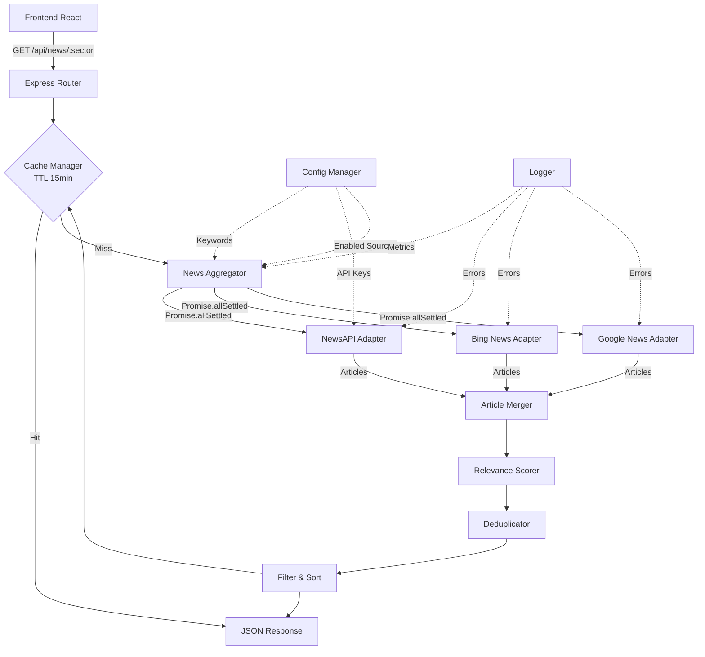
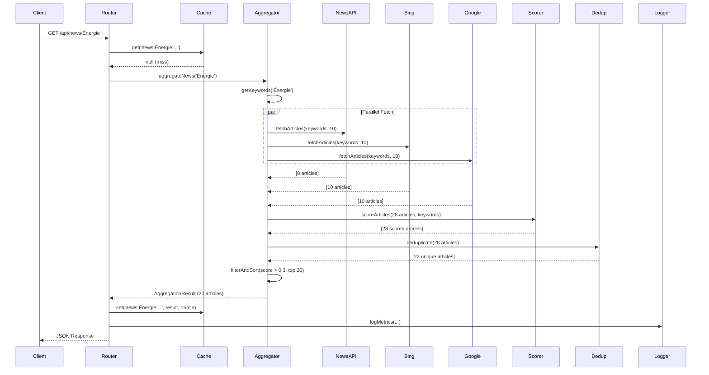
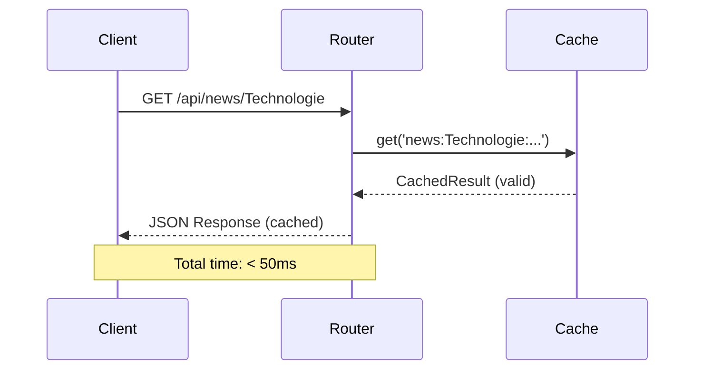
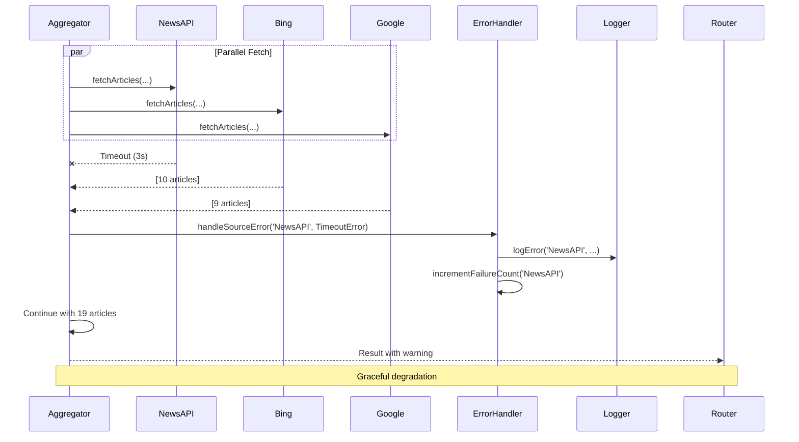

# Design Document: Multi-Source News Aggregation

## Overview

Ce document décrit l'architecture et la conception du système d'agrégation multi-sources d'actualités pour l'application d'analyse sectorielle. Le système remplace l'approche actuelle en cascade séquentielle (NewsAPI → Bing → Google) par une agrégation parallèle intelligente qui améliore significativement la pertinence des actualités affichées.

### Problème Actuel

L'implémentation actuelle dans `server/index.js` présente plusieurs limitations:
- Récupération séquentielle avec fallback (une seule source utilisée)
- Mots-clés génériques par secteur (ex: "energy oil gas renewable")
- Aucun scoring de pertinence
- Pas de déduplication entre sources
- Actualités peu pertinentes pour l'analyse sectorielle (ex: guerre Iran/détroit d'Ormuz absente du secteur Énergie)

### Solution Proposée

Le nouveau système NewsAggregator implémente:
- **Agrégation parallèle**: Fetch simultané de toutes les sources avec Promise.allSettled
- **Mots-clés enrichis**: 4 catégories par secteur (primary, secondary, geopolitical, contextual)
- **Scoring de pertinence**: Algorithme 0-1 basé sur fréquence, position et récence
- **Déduplication**: Similarité Jaccard sur les titres (seuil 70%)
- **Cache intelligent**: TTL 15 minutes avec métadonnées
- **Résilience**: Gestion gracieuse des erreurs par source

### Objectifs de Performance

- Agrégation complète: ≤ 5 secondes
- Timeout par source: 3 secondes
- Déduplication: ≤ 500ms pour 50 articles
- Cache hit: < 50ms
- Minimum 10 articles par source (si disponibles)
- Maximum 20 articles retournés après filtrage

## Architecture

### Vue d'Ensemble



### Flux de Données

1. **Requête**: Client → Express Router → Cache Manager
2. **Cache Miss**: Cache Manager → News Aggregator
3. **Fetch Parallèle**: News Aggregator → [NewsAPI, Bing, Google] (Promise.allSettled)
4. **Merge**: Adapters → Article Merger (combine tous les articles)
5. **Scoring**: Article Merger → Relevance Scorer (calcul score 0-1)
6. **Déduplication**: Relevance Scorer → Deduplicator (Jaccard similarity)
7. **Filtrage**: Deduplicator → Filter (score > 0.3, top 20)
8. **Cache & Response**: Filter → Cache Manager → Client

### Patterns Architecturaux

- **Adapter Pattern**: Normalisation des différentes sources d'actualités
- **Strategy Pattern**: Algorithmes de scoring et déduplication interchangeables
- **Cache-Aside Pattern**: Cache avec lazy loading et TTL
- **Circuit Breaker**: Désactivation temporaire des sources défaillantes (3 échecs consécutifs)

## Components and Interfaces

### 1. NewsAggregator (Core)

Module principal orchestrant l'agrégation.

```typescript
interface NewsAggregatorConfig {
  sources: SourceConfig[]
  cache: CacheConfig
  scoring: ScoringConfig
  deduplication: DeduplicationConfig
}

interface SourceConfig {
  name: string
  enabled: boolean
  adapter: NewsSourceAdapter
  timeout: number // milliseconds
  maxArticles: number
}

class NewsAggregator {
  constructor(config: NewsAggregatorConfig)
  
  async aggregateNews(sector: string): Promise<AggregationResult>
  async fetchFromAllSources(sector: string, keywords: string[]): Promise<Article[]>
  private async fetchWithTimeout(adapter: NewsSourceAdapter, keywords: string[], timeout: number): Promise<Article[]>
}
```

**Responsabilités**:
- Orchestration du fetch parallèle avec Promise.allSettled
- Gestion des timeouts (3s par source)
- Coordination des étapes: merge → score → deduplicate → filter
- Logging des métriques et erreurs

### 2. NewsSourceAdapter (Interface)

Interface commune pour tous les adaptateurs de sources.

```typescript
interface Article {
  id: string // Generated: `${source}-${hash(title)}`
  title: string
  snippet: string
  date: Date
  source: string
  url?: string
  rawData?: any // Original data from source
}

interface NewsSourceAdapter {
  name: string
  
  async fetchArticles(keywords: string[], maxResults: number): Promise<Article[]>
  isConfigured(): boolean
  getStatus(): SourceStatus
}

interface SourceStatus {
  available: boolean
  lastSuccess: Date | null
  lastError: Error | null
  consecutiveFailures: number
}
```

**Implémentations**:

#### NewsApiAdapter
```typescript
class NewsApiAdapter implements NewsSourceAdapter {
  constructor(apiKey: string)
  
  async fetchArticles(keywords: string[], maxResults: number): Promise<Article[]>
  // Utilise: https://newsapi.org/v2/everything
  // Query: keywords.join(' OR ')
  // Params: language=en, sortBy=publishedAt, pageSize=maxResults
}
```

#### BingNewsAdapter
```typescript
class BingNewsAdapter implements NewsSourceAdapter {
  async fetchArticles(keywords: string[], maxResults: number): Promise<Article[]>
  // Utilise: https://www.bing.com/news/search?q={keywords}&format=rss
  // Parse RSS avec regex: <item>...</item>
  // Extraction: title, description, pubDate
}
```

#### GoogleNewsAdapter
```typescript
class GoogleNewsAdapter implements NewsSourceAdapter {
  async fetchArticles(keywords: string[], maxResults: number): Promise<Article[]>
  // Utilise: https://news.google.com/rss/search?q={keywords}&hl=fr&gl=FR
  // Parse RSS avec regex: <item>...</item>
  // Extraction: title (CDATA), description (CDATA), pubDate
}
```

### 3. KeywordManager

Gestion des mots-clés enrichis par secteur.

```typescript
interface SectorKeywords {
  primary: string[]      // Mots-clés directs du secteur
  secondary: string[]    // Termes connexes
  geopolitical: string[] // Événements géopolitiques impactants
  contextual: string[]   // Contexte économique/réglementaire
}

class KeywordManager {
  private keywords: Map<string, SectorKeywords>
  
  getKeywords(sector: string): string[]
  // Retourne: [...primary, ...secondary, ...geopolitical, ...contextual]
  
  addKeywords(sector: string, category: keyof SectorKeywords, keywords: string[]): void
  removeKeywords(sector: string, category: keyof SectorKeywords, keywords: string[]): void
}
```

**Mots-clés par Secteur** (exemples):

```typescript
const SECTOR_KEYWORDS: Record<string, SectorKeywords> = {
  'Énergie': {
    primary: ['oil', 'gas', 'energy', 'petroleum', 'crude'],
    secondary: ['renewable', 'solar', 'wind', 'nuclear', 'coal'],
    geopolitical: ['OPEC', 'Strait of Hormuz', 'pipeline', 'sanctions', 'embargo'],
    contextual: ['carbon tax', 'climate policy', 'energy transition', 'drilling']
  },
  'Technologie': {
    primary: ['technology', 'software', 'AI', 'tech', 'digital'],
    secondary: ['semiconductor', 'chip', 'cloud', 'SaaS', 'hardware'],
    geopolitical: ['tech regulation', 'antitrust', 'data privacy', 'export controls'],
    contextual: ['innovation', 'R&D', 'patent', 'cybersecurity', 'quantum']
  },
  'Santé': {
    primary: ['healthcare', 'pharma', 'medical', 'biotech', 'drug'],
    secondary: ['hospital', 'clinical trial', 'FDA', 'vaccine', 'therapy'],
    geopolitical: ['pandemic', 'health crisis', 'drug pricing', 'patent'],
    contextual: ['aging population', 'insurance', 'Medicare', 'regulation']
  },
  'Télécoms': {
    primary: ['telecom', '5G', 'telecommunications', 'wireless', 'network'],
    secondary: ['fiber', 'broadband', 'mobile', 'spectrum', 'infrastructure'],
    geopolitical: ['spectrum auction', 'telecom regulation', 'net neutrality'],
    contextual: ['connectivity', 'bandwidth', 'tower', 'satellite']
  },
  'Industrie': {
    primary: ['manufacturing', 'industry', 'aerospace', 'defense', 'industrial'],
    secondary: ['factory', 'production', 'automation', 'robotics', 'machinery'],
    geopolitical: ['trade war', 'tariff', 'supply chain', 'export', 'sanctions'],
    contextual: ['capacity', 'orders', 'backlog', 'inventory', 'logistics']
  },
  'Services Publics': {
    primary: ['utilities', 'electricity', 'power', 'water', 'infrastructure'],
    secondary: ['grid', 'transmission', 'distribution', 'generation', 'utility'],
    geopolitical: ['regulation', 'rate case', 'subsidy', 'public service'],
    contextual: ['renewable mandate', 'capacity', 'demand', 'weather']
  }
}
```

### 4. RelevanceScorer

Calcul du score de pertinence 0-1 pour chaque article.

```typescript
interface ScoringConfig {
  titleWeight: number      // Default: 0.5
  snippetWeight: number    // Default: 0.3
  recencyWeight: number    // Default: 0.2
  keywordBonus: number     // Default: 0.1 per additional keyword
}

interface ScoredArticle extends Article {
  relevanceScore: number
  matchedKeywords: string[]
}

class RelevanceScorer {
  constructor(config: ScoringConfig)
  
  scoreArticles(articles: Article[], keywords: string[]): ScoredArticle[]
  private calculateScore(article: Article, keywords: string[]): number
  private getRecencyScore(date: Date): number
  private countKeywordMatches(text: string, keywords: string[]): number
}
```

**Algorithme de Scoring**:

```
score = (titleScore * titleWeight) + 
        (snippetScore * snippetWeight) + 
        (recencyScore * recencyWeight) +
        (keywordBonus * additionalKeywords)

où:
- titleScore = (keywords in title) / (total keywords)
- snippetScore = (keywords in snippet) / (total keywords)
- recencyScore = 1.0 si < 24h, 0.8 si < 3j, 0.6 si < 7j, 0.4 sinon
- additionalKeywords = max(0, matchedKeywords - 1)
```

### 5. Deduplicator

Détection et élimination des doublons.

```typescript
interface DeduplicationConfig {
  similarityThreshold: number // Default: 0.7 (70%)
  algorithm: 'jaccard' | 'levenshtein'
}

class Deduplicator {
  constructor(config: DeduplicationConfig)
  
  deduplicate(articles: ScoredArticle[]): ScoredArticle[]
  private calculateSimilarity(title1: string, title2: string): number
  private jaccardSimilarity(set1: Set<string>, set2: Set<string>): number
}
```

**Algorithme Jaccard**:

```
Jaccard(A, B) = |A ∩ B| / |A ∪ B|

où A et B sont les ensembles de mots (tokens) des titres

Exemple:
Title 1: "Oil prices surge amid Middle East tensions"
Title 2: "Oil prices rise on Middle East conflict"

Tokens A: {oil, prices, surge, amid, middle, east, tensions}
Tokens B: {oil, prices, rise, on, middle, east, conflict}

Intersection: {oil, prices, middle, east} = 4
Union: {oil, prices, surge, amid, middle, east, tensions, rise, on, conflict} = 10

Jaccard = 4/10 = 0.4 < 0.7 → Pas de doublon
```

**Stratégie de Résolution**:
1. Si similarité > seuil: garder l'article avec le score le plus élevé
2. Si scores égaux: garder l'article le plus récent
3. Si dates égales: garder le premier dans la liste

### 6. CacheManager

Gestion du cache avec TTL.

```typescript
interface CacheConfig {
  ttl: number // milliseconds, default: 900000 (15 min)
  maxSize: number // default: 100 entries
}

interface CacheEntry {
  data: AggregationResult
  timestamp: Date
  expiresAt: Date
}

class CacheManager {
  constructor(config: CacheConfig)
  
  get(key: string): AggregationResult | null
  set(key: string, value: AggregationResult): void
  has(key: string): boolean
  isExpired(key: string): boolean
  clear(): void
  
  private evictOldest(): void // LRU eviction si maxSize atteint
}
```

**Clé de Cache**: `news:${sector}:${timestamp_rounded_to_15min}`

### 7. Logger & Metrics

Observabilité du système.

```typescript
interface AggregationMetrics {
  sector: string
  timestamp: Date
  totalDuration: number // milliseconds
  
  sources: {
    [sourceName: string]: {
      success: boolean
      duration: number
      articlesCount: number
      error?: string
    }
  }
  
  totalArticlesFetched: number
  articlesAfterDeduplication: number
  articlesReturned: number
  averageRelevanceScore: number
  
  cacheStatus: 'hit' | 'miss'
}

class MetricsLogger {
  logAggregation(metrics: AggregationMetrics): void
  logSourceFailure(source: string, error: Error): void
  logCacheHit(sector: string): void
  logCacheMiss(sector: string): void
}
```

## Data Models

### Article (Raw)

```typescript
interface Article {
  id: string              // Format: `${source}-${hash(title)}`
  title: string           // Max 200 chars
  snippet: string         // Max 300 chars
  date: Date              // Publication date
  source: string          // 'NewsAPI' | 'Bing News' | 'Google News'
  url?: string            // Optional article URL
  rawData?: any           // Original response from source
}
```

### ScoredArticle

```typescript
interface ScoredArticle extends Article {
  relevanceScore: number      // 0.0 to 1.0
  matchedKeywords: string[]   // Keywords found in title/snippet
}
```

### AggregationResult (API Response)

```typescript
interface AggregationResult {
  articles: ArticleResponse[]
  metadata: AggregationMetadata
  error?: string
}

interface ArticleResponse {
  title: string
  snippet: string
  date: string              // Human-readable: "Il y a 2h", "Hier", "Il y a 3 jours"
  source: string
  url?: string
  relevanceScore: number
}

interface AggregationMetadata {
  timestamp: string         // ISO 8601
  totalArticles: number
  sourcesUsed: string[]
  cacheStatus: 'hit' | 'miss'
  aggregationTime?: number  // milliseconds (only on cache miss)
}
```

### Configuration

```typescript
interface NewsAggregatorConfiguration {
  sources: {
    newsapi: {
      enabled: boolean
      apiKey: string
      timeout: number
      maxArticles: number
    }
    bing: {
      enabled: boolean
      timeout: number
      maxArticles: number
    }
    google: {
      enabled: boolean
      timeout: number
      maxArticles: number
    }
  }
  
  cache: {
    enabled: boolean
    ttl: number
    maxSize: number
  }
  
  scoring: {
    titleWeight: number
    snippetWeight: number
    recencyWeight: number
    keywordBonus: number
  }
  
  deduplication: {
    enabled: boolean
    similarityThreshold: number
    algorithm: 'jaccard' | 'levenshtein'
  }
  
  filtering: {
    minRelevanceScore: number
    fallbackMinScore: number
    minArticlesThreshold: number
    maxArticlesReturned: number
  }
}
```

**Valeurs par Défaut**:

```typescript
const DEFAULT_CONFIG: NewsAggregatorConfiguration = {
  sources: {
    newsapi: { enabled: true, apiKey: process.env.NEWS_API_KEY, timeout: 3000, maxArticles: 10 },
    bing: { enabled: true, timeout: 3000, maxArticles: 10 },
    google: { enabled: true, timeout: 3000, maxArticles: 10 }
  },
  cache: { enabled: true, ttl: 900000, maxSize: 100 },
  scoring: { titleWeight: 0.5, snippetWeight: 0.3, recencyWeight: 0.2, keywordBonus: 0.1 },
  deduplication: { enabled: true, similarityThreshold: 0.7, algorithm: 'jaccard' },
  filtering: { minRelevanceScore: 0.3, fallbackMinScore: 0.2, minArticlesThreshold: 5, maxArticlesReturned: 20 }
}
```


## Correctness Properties

*A property is a characteristic or behavior that should hold true across all valid executions of a system—essentially, a formal statement about what the system should do. Properties serve as the bridge between human-readable specifications and machine-verifiable correctness guarantees.*

### Property Reflection

Après analyse des critères d'acceptation, plusieurs propriétés peuvent être consolidées pour éviter la redondance:

- **Propriétés 3.3, 3.4, 3.6**: Ces trois propriétés testent différents aspects du scoring mais peuvent être combinées en une propriété métamorphique globale sur le comportement du scoring
- **Propriétés 9.1-9.5**: Toutes les propriétés de logging peuvent être consolidées en une seule propriété vérifiant que tous les métriques requis sont loggés
- **Propriétés 10.2, 10.3, 10.5**: Ces propriétés sur la structure de réponse peuvent être combinées en une propriété de validation de schéma
- **Propriétés 6.1, 6.2**: Ces deux propriétés sur la gestion d'erreurs peuvent être combinées en une propriété de résilience générale

### Property 1: Parallel Fetch Execution

*For any* sector request, when fetching articles from multiple configured sources, all fetch operations SHALL execute in parallel such that the total execution time is not the sum of individual source fetch times.

**Validates: Requirements 1.1**

### Property 2: Resilience to Source Failures

*For any* news aggregation request, when one or more sources fail or timeout, the aggregator SHALL continue processing with remaining sources and return results from successful sources without blocking.

**Validates: Requirements 1.3, 6.1, 6.2**

### Property 3: Aggregation Timeout Compliance

*For any* sector request, the complete aggregation process (including all parallel fetches, scoring, deduplication, and filtering) SHALL complete within 5 seconds maximum.

**Validates: Requirements 1.4**

### Property 4: Minimum Articles Per Source

*For any* news source that has articles available, the aggregator SHALL retrieve at least 10 articles from that source (up to the source's availability).

**Validates: Requirements 1.5**

### Property 5: Sector Keywords Completeness

*For any* supported sector, the keyword mapping SHALL contain at least 8 keywords total across all categories (primary, secondary, geopolitical, contextual).

**Validates: Requirements 2.1, 2.8**

### Property 6: Relevance Score Calculation

*For any* retrieved article, the aggregator SHALL calculate a relevance score that is a numeric value between 0.0 and 1.0 inclusive.

**Validates: Requirements 3.1, 3.2**

### Property 7: Scoring Monotonicity with Keyword Frequency

*For any* article, if we increase the number of matching keywords in the title or snippet (without changing other factors), the relevance score SHALL increase or remain the same.

**Validates: Requirements 3.3, 3.6**

### Property 8: Title Weight Dominance

*For any* article, if we move a matching keyword from the snippet to the title (keeping total keyword count constant), the relevance score SHALL increase.

**Validates: Requirements 3.4**

### Property 9: Recency Score Monotonicity

*For any* two articles with identical content but different publication dates, the more recent article SHALL have a relevance score greater than or equal to the older article.

**Validates: Requirements 3.5**

### Property 10: Deduplication Execution

*For any* set of articles containing pairs with title similarity above 70%, the deduplicator SHALL identify and remove duplicates, keeping only one article from each duplicate group.

**Validates: Requirements 4.1, 4.2**

### Property 11: Duplicate Resolution by Score

*For any* pair of duplicate articles (similarity > 70%), the deduplicator SHALL keep the article with the higher relevance score, or if scores are equal, the more recent article.

**Validates: Requirements 4.3, 4.4**

### Property 12: Deduplication Performance

*For any* set of up to 50 articles, the deduplication process SHALL complete within 500 milliseconds.

**Validates: Requirements 4.5**

### Property 13: Result Sorting by Relevance

*For any* aggregation result, the returned articles SHALL be sorted in descending order by relevance score (highest score first).

**Validates: Requirements 5.1**

### Property 14: Relevance Score Filtering

*For any* aggregation result with at least 5 articles scoring above 0.3, all returned articles SHALL have a relevance score of at least 0.3.

**Validates: Requirements 5.2**

### Property 15: Maximum Articles Limit

*For any* sector aggregation, the result SHALL contain at most 20 articles regardless of how many articles were fetched and scored.

**Validates: Requirements 5.3**

### Property 16: Response Structure Completeness

*For any* aggregation result, each article SHALL include all required fields (title, snippet, date, source, url, relevanceScore) and the response SHALL include metadata with all required fields (timestamp, totalArticles, sourcesUsed, cacheStatus).

**Validates: Requirements 5.5, 10.2, 10.3**

### Property 17: Source Availability in Metadata

*For any* aggregation response, the metadata SHALL include the availability status of each configured news source indicating success or failure.

**Validates: Requirements 6.4**

### Property 18: Disabled Source Exclusion

*For any* news source that is disabled in configuration, the aggregator SHALL not attempt to fetch articles from that source during aggregation.

**Validates: Requirements 7.4**

### Property 19: API Key Validation

*For any* news source requiring an API key, the aggregator SHALL validate the key's presence and format before attempting to fetch articles.

**Validates: Requirements 7.2**

### Property 20: Cache Hit Behavior

*For any* sector request where a valid (non-expired) cached result exists, the aggregator SHALL return the cached result without fetching from any news sources.

**Validates: Requirements 8.3**

### Property 21: Cache Refresh on Expiration

*For any* sector request where the cached result is expired (older than 15 minutes), the aggregator SHALL fetch fresh articles from all sources and update the cache with the new result.

**Validates: Requirements 8.4**

### Property 22: Cache Status in Response

*For any* aggregation response, the metadata SHALL include a cache status field indicating either "hit" or "miss" and a timestamp.

**Validates: Requirements 8.5**

### Property 23: Metrics Logging Completeness

*For any* aggregation request, the system SHALL log all required metrics including: articles fetched per source, total aggregation time, articles after deduplication, average relevance score, and any source failures with error details.

**Validates: Requirements 9.1, 9.2, 9.3, 9.4, 9.5**

### Property 24: JSON Response Format

*For any* aggregation request (successful or failed), the response SHALL be valid JSON that can be parsed without errors.

**Validates: Requirements 10.1**

### Property 25: French Date Formatting

*For any* article in the response, the date field SHALL be formatted in French human-readable format (e.g., "Il y a 2h", "Hier", "Il y a 3 jours") rather than ISO timestamp format.

**Validates: Requirements 10.4**

### Property 26: Error Response Structure

*For any* aggregation request that encounters an error preventing article retrieval, the response SHALL contain an empty articles array and an error field describing the issue.

**Validates: Requirements 10.5**

## Error Handling

### Error Categories

1. **Source-Level Errors**
   - Network timeouts (3s per source)
   - HTTP errors (4xx, 5xx)
   - Invalid API keys
   - Rate limiting
   - Malformed responses

2. **System-Level Errors**
   - All sources failed
   - Cache errors
   - Configuration errors
   - Scoring/deduplication errors

3. **Data-Level Errors**
   - Missing required fields
   - Invalid date formats
   - Empty responses

### Error Handling Strategy

```typescript
class ErrorHandler {
  handleSourceError(source: string, error: Error): void {
    // Log error with context
    logger.error(`Source ${source} failed`, { error, timestamp: new Date() })
    
    // Update source status
    sourceStatus[source].consecutiveFailures++
    sourceStatus[source].lastError = error
    
    // Circuit breaker: disable after 3 consecutive failures
    if (sourceStatus[source].consecutiveFailures >= 3) {
      logger.warn(`Source ${source} disabled after 3 consecutive failures`)
      sourceStatus[source].available = false
    }
  }
  
  handleAllSourcesFailure(): AggregationResult {
    return {
      articles: [],
      metadata: {
        timestamp: new Date().toISOString(),
        totalArticles: 0,
        sourcesUsed: [],
        cacheStatus: 'miss'
      },
      error: 'All news sources failed to retrieve articles'
    }
  }
  
  handlePartialFailure(successfulSources: string[], failedSources: string[]): void {
    logger.warn('Partial source failure', {
      successful: successfulSources,
      failed: failedSources
    })
  }
}
```

### Timeout Strategy

```typescript
async function fetchWithTimeout<T>(
  promise: Promise<T>,
  timeoutMs: number,
  source: string
): Promise<T | null> {
  const timeoutPromise = new Promise<null>((resolve) => {
    setTimeout(() => {
      logger.warn(`Source ${source} timed out after ${timeoutMs}ms`)
      resolve(null)
    }, timeoutMs)
  })
  
  return Promise.race([promise, timeoutPromise])
}
```

### Graceful Degradation

1. **Single Source Failure**: Continue with remaining sources
2. **Multiple Source Failures**: Return results from successful sources
3. **All Sources Failed**: Return empty result with error message
4. **Cache Failure**: Bypass cache and fetch fresh data
5. **Scoring/Dedup Failure**: Return unscored/non-deduplicated results with warning

### Error Response Examples

**Partial Failure** (some sources succeeded):
```json
{
  "articles": [...],
  "metadata": {
    "timestamp": "2025-01-15T10:30:00Z",
    "totalArticles": 12,
    "sourcesUsed": ["Bing News", "Google News"],
    "cacheStatus": "miss",
    "warnings": ["NewsAPI failed: timeout after 3000ms"]
  }
}
```

**Complete Failure** (all sources failed):
```json
{
  "articles": [],
  "metadata": {
    "timestamp": "2025-01-15T10:30:00Z",
    "totalArticles": 0,
    "sourcesUsed": [],
    "cacheStatus": "miss"
  },
  "error": "All news sources failed to retrieve articles"
}
```

## Testing Strategy

### Dual Testing Approach

Le système sera testé avec deux approches complémentaires:

1. **Unit Tests**: Exemples spécifiques, cas limites, scénarios d'erreur
2. **Property-Based Tests**: Propriétés universelles sur tous les inputs

Les tests unitaires sont utiles pour valider des comportements spécifiques et des cas limites, mais il ne faut pas en écrire trop. Les tests basés sur les propriétés gèrent la couverture de nombreux inputs via la randomisation.

### Property-Based Testing Configuration

**Framework**: [fast-check](https://github.com/dubzzz/fast-check) pour Node.js/TypeScript

**Configuration**:
- Minimum 100 itérations par test de propriété
- Chaque test doit référencer sa propriété du document de design
- Format de tag: `Feature: multi-source-news-aggregation, Property {number}: {property_text}`

**Exemple de Test de Propriété**:

```typescript
import fc from 'fast-check'

describe('NewsAggregator Properties', () => {
  // Feature: multi-source-news-aggregation, Property 6: Relevance Score Calculation
  it('should calculate relevance scores between 0 and 1 for all articles', () => {
    fc.assert(
      fc.property(
        fc.array(articleArbitrary(), { minLength: 1, maxLength: 50 }),
        fc.array(fc.string(), { minLength: 1, maxLength: 20 }),
        (articles, keywords) => {
          const scorer = new RelevanceScorer(DEFAULT_SCORING_CONFIG)
          const scored = scorer.scoreArticles(articles, keywords)
          
          return scored.every(article => 
            article.relevanceScore >= 0.0 && 
            article.relevanceScore <= 1.0
          )
        }
      ),
      { numRuns: 100 }
    )
  })
  
  // Feature: multi-source-news-aggregation, Property 7: Scoring Monotonicity with Keyword Frequency
  it('should increase score when adding matching keywords', () => {
    fc.assert(
      fc.property(
        articleArbitrary(),
        fc.array(fc.string(), { minLength: 2, maxLength: 10 }),
        (article, keywords) => {
          const scorer = new RelevanceScorer(DEFAULT_SCORING_CONFIG)
          
          // Score with subset of keywords
          const scored1 = scorer.scoreArticles([article], keywords.slice(0, 1))
          
          // Score with all keywords (assuming article matches more)
          const scored2 = scorer.scoreArticles([article], keywords)
          
          // If more keywords match, score should be >= original
          return scored2[0].relevanceScore >= scored1[0].relevanceScore
        }
      ),
      { numRuns: 100 }
    )
  })
  
  // Feature: multi-source-news-aggregation, Property 13: Result Sorting by Relevance
  it('should return articles sorted by relevance score descending', () => {
    fc.assert(
      fc.property(
        fc.array(scoredArticleArbitrary(), { minLength: 2, maxLength: 50 }),
        (articles) => {
          const aggregator = new NewsAggregator(DEFAULT_CONFIG)
          const result = aggregator.filterAndSort(articles)
          
          // Check that each article has score >= next article
          for (let i = 0; i < result.length - 1; i++) {
            if (result[i].relevanceScore < result[i + 1].relevanceScore) {
              return false
            }
          }
          return true
        }
      ),
      { numRuns: 100 }
    )
  })
})
```

### Unit Testing Focus Areas

**Exemples Spécifiques**:
- Secteurs spécifiques avec mots-clés connus (Énergie, Technologie, etc.)
- Seuils de similarité exacts (69%, 70%, 71%)
- Scénarios de fallback (< 5 articles avec score > 0.3)
- Configuration des sources (activation/désactivation)
- Format de date français pour différentes périodes

**Cas Limites**:
- Articles sans snippet
- Articles sans URL
- Dates futures ou très anciennes
- Titres vides ou très longs
- Aucun mot-clé ne correspond
- Tous les articles sont des doublons

**Scénarios d'Erreur**:
- Toutes les sources échouent
- Timeout de toutes les sources
- Clé API invalide
- Réponse JSON malformée
- Cache corrompu

**Tests d'Intégration**:
- Flux complet: fetch → score → deduplicate → filter → cache
- Interaction entre composants
- Vérification des logs et métriques

### Générateurs pour Property-Based Testing

```typescript
// Arbitrary generators for fast-check
const articleArbitrary = () => fc.record({
  id: fc.string(),
  title: fc.string({ minLength: 10, maxLength: 200 }),
  snippet: fc.string({ minLength: 20, maxLength: 300 }),
  date: fc.date({ min: new Date('2024-01-01'), max: new Date() }),
  source: fc.constantFrom('NewsAPI', 'Bing News', 'Google News'),
  url: fc.webUrl()
})

const scoredArticleArbitrary = () => fc.record({
  ...articleArbitrary(),
  relevanceScore: fc.float({ min: 0.0, max: 1.0 }),
  matchedKeywords: fc.array(fc.string(), { maxLength: 10 })
})

const sectorArbitrary = () => fc.constantFrom(
  'Énergie', 'Technologie', 'Santé', 'Télécoms', 'Industrie', 'Services Publics'
)
```

### Test Coverage Goals

- **Line Coverage**: > 90%
- **Branch Coverage**: > 85%
- **Function Coverage**: 100%
- **Property Tests**: Toutes les 26 propriétés implémentées
- **Unit Tests**: Minimum 50 tests couvrant exemples et cas limites

### Continuous Testing

- Tests exécutés sur chaque commit (CI/CD)
- Property tests avec seed fixe pour reproductibilité
- Tests de performance pour timeouts et cache
- Tests de charge pour vérifier la résilience sous stress


## Implementation Details

### Sequence Diagrams

#### Agrégation Complète (Cache Miss)



#### Agrégation avec Cache Hit



#### Gestion d'Erreur Partielle



### Implementation Examples

#### NewsAggregator Core

```typescript
export class NewsAggregator {
  private config: NewsAggregatorConfiguration
  private cache: CacheManager
  private keywordManager: KeywordManager
  private scorer: RelevanceScorer
  private deduplicator: Deduplicator
  private logger: MetricsLogger
  private errorHandler: ErrorHandler
  
  constructor(config: NewsAggregatorConfiguration) {
    this.config = config
    this.cache = new CacheManager(config.cache)
    this.keywordManager = new KeywordManager(SECTOR_KEYWORDS)
    this.scorer = new RelevanceScorer(config.scoring)
    this.deduplicator = new Deduplicator(config.deduplication)
    this.logger = new MetricsLogger()
    this.errorHandler = new ErrorHandler()
  }
  
  async aggregateNews(sector: string): Promise<AggregationResult> {
    const startTime = Date.now()
    
    // Check cache
    const cacheKey = this.getCacheKey(sector)
    if (this.config.cache.enabled) {
      const cached = this.cache.get(cacheKey)
      if (cached) {
        this.logger.logCacheHit(sector)
        return cached
      }
      this.logger.logCacheMiss(sector)
    }
    
    // Get keywords for sector
    const keywords = this.keywordManager.getKeywords(sector)
    
    // Fetch from all sources in parallel
    const articles = await this.fetchFromAllSources(sector, keywords)
    
    if (articles.length === 0) {
      return this.errorHandler.handleAllSourcesFailure()
    }
    
    // Score articles
    const scoredArticles = this.scorer.scoreArticles(articles, keywords)
    
    // Deduplicate
    const uniqueArticles = this.config.deduplication.enabled
      ? this.deduplicator.deduplicate(scoredArticles)
      : scoredArticles
    
    // Filter and sort
    const filteredArticles = this.filterAndSort(uniqueArticles)
    
    // Build result
    const result: AggregationResult = {
      articles: filteredArticles.map(this.formatArticle),
      metadata: {
        timestamp: new Date().toISOString(),
        totalArticles: filteredArticles.length,
        sourcesUsed: this.getSuccessfulSources(),
        cacheStatus: 'miss',
        aggregationTime: Date.now() - startTime
      }
    }
    
    // Cache result
    if (this.config.cache.enabled) {
      this.cache.set(cacheKey, result)
    }
    
    // Log metrics
    this.logger.logAggregation({
      sector,
      timestamp: new Date(),
      totalDuration: Date.now() - startTime,
      sources: this.getSourceMetrics(),
      totalArticlesFetched: articles.length,
      articlesAfterDeduplication: uniqueArticles.length,
      articlesReturned: filteredArticles.length,
      averageRelevanceScore: this.calculateAverageScore(filteredArticles),
      cacheStatus: 'miss'
    })
    
    return result
  }
  
  private async fetchFromAllSources(
    sector: string,
    keywords: string[]
  ): Promise<Article[]> {
    const adapters = this.getEnabledAdapters()
    
    // Fetch in parallel with Promise.allSettled
    const results = await Promise.allSettled(
      adapters.map(adapter =>
        this.fetchWithTimeout(
          adapter,
          keywords,
          this.config.sources[adapter.name.toLowerCase()].timeout
        )
      )
    )
    
    // Collect successful results
    const articles: Article[] = []
    results.forEach((result, index) => {
      const adapter = adapters[index]
      
      if (result.status === 'fulfilled' && result.value) {
        articles.push(...result.value)
        this.errorHandler.recordSuccess(adapter.name)
      } else if (result.status === 'rejected') {
        this.errorHandler.handleSourceError(adapter.name, result.reason)
      }
    })
    
    return articles
  }
  
  private async fetchWithTimeout(
    adapter: NewsSourceAdapter,
    keywords: string[],
    timeoutMs: number
  ): Promise<Article[] | null> {
    const timeoutPromise = new Promise<null>((resolve) => {
      setTimeout(() => resolve(null), timeoutMs)
    })
    
    const fetchPromise = adapter.fetchArticles(
      keywords,
      this.config.sources[adapter.name.toLowerCase()].maxArticles
    )
    
    const result = await Promise.race([fetchPromise, timeoutPromise])
    
    if (result === null) {
      throw new Error(`Timeout after ${timeoutMs}ms`)
    }
    
    return result
  }
  
  private filterAndSort(articles: ScoredArticle[]): ScoredArticle[] {
    const { minRelevanceScore, fallbackMinScore, minArticlesThreshold, maxArticlesReturned } = 
      this.config.filtering
    
    // Try with primary threshold
    let filtered = articles.filter(a => a.relevanceScore >= minRelevanceScore)
    
    // Fallback if too few articles
    if (filtered.length < minArticlesThreshold) {
      filtered = articles.filter(a => a.relevanceScore >= fallbackMinScore)
    }
    
    // Sort by score descending
    filtered.sort((a, b) => b.relevanceScore - a.relevanceScore)
    
    // Limit to max articles
    return filtered.slice(0, maxArticlesReturned)
  }
  
  private formatArticle(article: ScoredArticle): ArticleResponse {
    return {
      title: article.title,
      snippet: article.snippet,
      date: this.formatDateFrench(article.date),
      source: article.source,
      url: article.url,
      relevanceScore: Math.round(article.relevanceScore * 100) / 100
    }
  }
  
  private formatDateFrench(date: Date): string {
    const now = new Date()
    const diffMs = now.getTime() - date.getTime()
    const diffMins = Math.floor(diffMs / (1000 * 60))
    const diffHours = Math.floor(diffMs / (1000 * 60 * 60))
    const diffDays = Math.floor(diffMs / (1000 * 60 * 60 * 24))
    
    if (diffMins < 60) {
      return `Il y a ${diffMins} min`
    } else if (diffHours < 24) {
      return `Il y a ${diffHours}h`
    } else if (diffDays === 1) {
      return 'Hier'
    } else if (diffDays < 7) {
      return `Il y a ${diffDays} jours`
    } else {
      return date.toLocaleDateString('fr-FR', { day: '2-digit', month: '2-digit' })
    }
  }
  
  private getCacheKey(sector: string): string {
    const now = Date.now()
    const roundedTime = Math.floor(now / (15 * 60 * 1000)) * (15 * 60 * 1000)
    return `news:${sector}:${roundedTime}`
  }
  
  private getEnabledAdapters(): NewsSourceAdapter[] {
    const adapters: NewsSourceAdapter[] = []
    
    if (this.config.sources.newsapi.enabled) {
      adapters.push(new NewsApiAdapter(this.config.sources.newsapi.apiKey))
    }
    if (this.config.sources.bing.enabled) {
      adapters.push(new BingNewsAdapter())
    }
    if (this.config.sources.google.enabled) {
      adapters.push(new GoogleNewsAdapter())
    }
    
    return adapters.filter(a => a.isConfigured())
  }
  
  private calculateAverageScore(articles: ScoredArticle[]): number {
    if (articles.length === 0) return 0
    const sum = articles.reduce((acc, a) => acc + a.relevanceScore, 0)
    return sum / articles.length
  }
}
```

#### RelevanceScorer Implementation

```typescript
export class RelevanceScorer {
  constructor(private config: ScoringConfig) {}
  
  scoreArticles(articles: Article[], keywords: string[]): ScoredArticle[] {
    return articles.map(article => ({
      ...article,
      relevanceScore: this.calculateScore(article, keywords),
      matchedKeywords: this.findMatchedKeywords(article, keywords)
    }))
  }
  
  private calculateScore(article: Article, keywords: string[]): number {
    const titleScore = this.getKeywordScore(article.title, keywords)
    const snippetScore = this.getKeywordScore(article.snippet, keywords)
    const recencyScore = this.getRecencyScore(article.date)
    const matchedCount = this.countKeywordMatches(
      article.title + ' ' + article.snippet,
      keywords
    )
    const keywordBonus = Math.max(0, matchedCount - 1) * this.config.keywordBonus
    
    const score = 
      (titleScore * this.config.titleWeight) +
      (snippetScore * this.config.snippetWeight) +
      (recencyScore * this.config.recencyWeight) +
      keywordBonus
    
    // Clamp to [0, 1]
    return Math.max(0, Math.min(1, score))
  }
  
  private getKeywordScore(text: string, keywords: string[]): number {
    if (!text || keywords.length === 0) return 0
    
    const lowerText = text.toLowerCase()
    const matchCount = keywords.filter(kw => 
      lowerText.includes(kw.toLowerCase())
    ).length
    
    return matchCount / keywords.length
  }
  
  private getRecencyScore(date: Date): number {
    const now = new Date()
    const diffMs = now.getTime() - date.getTime()
    const diffHours = diffMs / (1000 * 60 * 60)
    
    if (diffHours < 24) return 1.0
    if (diffHours < 72) return 0.8
    if (diffHours < 168) return 0.6
    return 0.4
  }
  
  private countKeywordMatches(text: string, keywords: string[]): number {
    const lowerText = text.toLowerCase()
    return keywords.filter(kw => lowerText.includes(kw.toLowerCase())).length
  }
  
  private findMatchedKeywords(article: Article, keywords: string[]): string[] {
    const text = (article.title + ' ' + article.snippet).toLowerCase()
    return keywords.filter(kw => text.includes(kw.toLowerCase()))
  }
}
```

#### Deduplicator Implementation

```typescript
export class Deduplicator {
  constructor(private config: DeduplicationConfig) {}
  
  deduplicate(articles: ScoredArticle[]): ScoredArticle[] {
    const unique: ScoredArticle[] = []
    const seen = new Set<number>()
    
    // Sort by score descending to keep best articles
    const sorted = [...articles].sort((a, b) => b.relevanceScore - a.relevanceScore)
    
    for (const article of sorted) {
      let isDuplicate = false
      
      for (const uniqueArticle of unique) {
        const similarity = this.calculateSimilarity(article.title, uniqueArticle.title)
        
        if (similarity > this.config.similarityThreshold) {
          isDuplicate = true
          break
        }
      }
      
      if (!isDuplicate) {
        unique.push(article)
      }
    }
    
    return unique
  }
  
  private calculateSimilarity(title1: string, title2: string): number {
    if (this.config.algorithm === 'jaccard') {
      return this.jaccardSimilarity(title1, title2)
    }
    throw new Error(`Unsupported algorithm: ${this.config.algorithm}`)
  }
  
  private jaccardSimilarity(str1: string, str2: string): number {
    const tokens1 = this.tokenize(str1)
    const tokens2 = this.tokenize(str2)
    
    const set1 = new Set(tokens1)
    const set2 = new Set(tokens2)
    
    const intersection = new Set([...set1].filter(x => set2.has(x)))
    const union = new Set([...set1, ...set2])
    
    if (union.size === 0) return 0
    
    return intersection.size / union.size
  }
  
  private tokenize(text: string): string[] {
    return text
      .toLowerCase()
      .replace(/[^\w\s]/g, '')
      .split(/\s+/)
      .filter(token => token.length > 2) // Ignore short words
  }
}
```

### Express Router Integration

```typescript
import express from 'express'
import { NewsAggregator } from './aggregator/NewsAggregator'
import { loadConfiguration } from './config/ConfigLoader'

const router = express.Router()
const config = loadConfiguration()
const aggregator = new NewsAggregator(config)

router.get('/api/news/:sector', async (req, res) => {
  const { sector } = req.params
  
  try {
    const result = await aggregator.aggregateNews(sector)
    res.json(result)
  } catch (error) {
    console.error('Error aggregating news:', error)
    res.status(500).json({
      articles: [],
      metadata: {
        timestamp: new Date().toISOString(),
        totalArticles: 0,
        sourcesUsed: [],
        cacheStatus: 'miss'
      },
      error: 'Internal server error during news aggregation'
    })
  }
})

export default router
```

### Configuration Loading

```typescript
import dotenv from 'dotenv'
import { NewsAggregatorConfiguration } from '../types'

dotenv.config()

export function loadConfiguration(): NewsAggregatorConfiguration {
  return {
    sources: {
      newsapi: {
        enabled: process.env.NEWSAPI_ENABLED !== 'false',
        apiKey: process.env.NEWS_API_KEY || '',
        timeout: parseInt(process.env.NEWSAPI_TIMEOUT || '3000'),
        maxArticles: parseInt(process.env.NEWSAPI_MAX_ARTICLES || '10')
      },
      bing: {
        enabled: process.env.BING_ENABLED !== 'false',
        timeout: parseInt(process.env.BING_TIMEOUT || '3000'),
        maxArticles: parseInt(process.env.BING_MAX_ARTICLES || '10')
      },
      google: {
        enabled: process.env.GOOGLE_ENABLED !== 'false',
        timeout: parseInt(process.env.GOOGLE_TIMEOUT || '3000'),
        maxArticles: parseInt(process.env.GOOGLE_MAX_ARTICLES || '10')
      }
    },
    cache: {
      enabled: process.env.CACHE_ENABLED !== 'false',
      ttl: parseInt(process.env.CACHE_TTL || '900000'), // 15 min
      maxSize: parseInt(process.env.CACHE_MAX_SIZE || '100')
    },
    scoring: {
      titleWeight: parseFloat(process.env.SCORING_TITLE_WEIGHT || '0.5'),
      snippetWeight: parseFloat(process.env.SCORING_SNIPPET_WEIGHT || '0.3'),
      recencyWeight: parseFloat(process.env.SCORING_RECENCY_WEIGHT || '0.2'),
      keywordBonus: parseFloat(process.env.SCORING_KEYWORD_BONUS || '0.1')
    },
    deduplication: {
      enabled: process.env.DEDUP_ENABLED !== 'false',
      similarityThreshold: parseFloat(process.env.DEDUP_THRESHOLD || '0.7'),
      algorithm: 'jaccard'
    },
    filtering: {
      minRelevanceScore: parseFloat(process.env.FILTER_MIN_SCORE || '0.3'),
      fallbackMinScore: parseFloat(process.env.FILTER_FALLBACK_SCORE || '0.2'),
      minArticlesThreshold: parseInt(process.env.FILTER_MIN_ARTICLES || '5'),
      maxArticlesReturned: parseInt(process.env.FILTER_MAX_ARTICLES || '20')
    }
  }
}
```

## Migration Strategy

### Phase 1: Parallel Implementation (Week 1-2)

1. Créer la nouvelle structure de modules dans `server/aggregator/`
2. Implémenter les adapters pour les 3 sources existantes
3. Implémenter le KeywordManager avec mots-clés enrichis
4. Implémenter RelevanceScorer et Deduplicator
5. Implémenter CacheManager
6. Tests unitaires et property-based tests

### Phase 2: Integration (Week 3)

1. Intégrer NewsAggregator dans Express router
2. Créer endpoint `/api/news/v2/:sector` pour tests A/B
3. Logging et monitoring
4. Tests d'intégration end-to-end
5. Tests de charge et performance

### Phase 3: Deployment (Week 4)

1. Déployer en production avec feature flag
2. Tester avec trafic réel (10% des requêtes)
3. Comparer métriques v1 vs v2:
   - Temps de réponse
   - Taux de cache hit
   - Pertinence des actualités (feedback utilisateur)
4. Augmenter progressivement le trafic (25%, 50%, 100%)
5. Basculer `/api/news/:sector` vers nouvelle implémentation
6. Retirer ancien code après 2 semaines de stabilité

### Rollback Plan

Si problèmes critiques détectés:
1. Feature flag → 0% trafic vers v2
2. Revenir à l'ancien endpoint
3. Analyser logs et métriques
4. Corriger les problèmes
5. Redéployer et retester

### Backward Compatibility

Le format de réponse JSON reste compatible:
```typescript
// Ancien format (conservé)
{
  news: Article[],
  timestamp: string,
  source: string
}

// Nouveau format (étendu)
{
  articles: Article[], // Renommé de 'news'
  metadata: {
    timestamp: string,
    totalArticles: number,
    sourcesUsed: string[], // Remplace 'source' unique
    cacheStatus: 'hit' | 'miss'
  }
}
```

Le frontend peut gérer les deux formats:
```typescript
const articles = response.articles || response.news || []
```

## Performance Considerations

### Bottlenecks Potentiels

1. **Fetch Parallèle**: Limité par la source la plus lente (max 3s timeout)
2. **Déduplication**: O(n²) pour comparaison de tous les titres
3. **Cache**: Mémoire limitée (100 entrées max)
4. **Scoring**: O(n × m) où n = articles, m = keywords

### Optimisations

1. **Déduplication**: Utiliser MinHash pour O(n) au lieu de O(n²)
2. **Cache**: Implémenter Redis pour cache distribué
3. **Scoring**: Pré-calculer les tokens des keywords
4. **Fetch**: Implémenter connection pooling pour HTTP requests

### Monitoring Metrics

- Temps de réponse P50, P95, P99
- Taux de cache hit/miss
- Nombre d'articles par source
- Taux d'échec par source
- Temps de déduplication
- Score de pertinence moyen
- Mémoire utilisée par le cache

## Security Considerations

### API Keys Protection

- Stocker les clés dans variables d'environnement
- Ne jamais logger les clés complètes
- Valider les clés au démarrage
- Rotation régulière des clés

### Rate Limiting

- Implémenter rate limiting par IP (ex: 60 req/min)
- Rate limiting par secteur pour éviter le spam
- Backoff exponentiel sur les sources externes

### Input Validation

- Valider le paramètre `sector` (whitelist)
- Sanitizer les keywords avant requêtes externes
- Limiter la taille des réponses des sources

### Error Information Disclosure

- Ne pas exposer les détails d'erreur internes au client
- Logger les erreurs détaillées côté serveur uniquement
- Messages d'erreur génériques pour le client

## Future Enhancements

### Phase 2 Features

1. **Sources Additionnelles**: Reuters, Bloomberg, Financial Times
2. **Filtrage par Langue**: Support multi-langue (FR, EN, DE)
3. **Sentiment Analysis**: Score de sentiment positif/négatif/neutre
4. **Catégorisation ML**: Classification automatique des actualités
5. **Personnalisation**: Préférences utilisateur pour sources/topics
6. **Notifications**: Alertes pour actualités à fort impact
7. **Historique**: Stockage des actualités pour analyse temporelle
8. **GraphQL API**: Alternative à REST pour queries flexibles

### Scalability Improvements

1. **Microservices**: Séparer l'agrégation en service dédié
2. **Message Queue**: RabbitMQ/Kafka pour fetch asynchrone
3. **Distributed Cache**: Redis Cluster pour haute disponibilité
4. **CDN**: Cache des réponses au niveau CDN
5. **Load Balancing**: Multiple instances de l'aggregator

---

**Document Version**: 1.0  
**Last Updated**: 2025-01-15  
**Authors**: AI Development Team  
**Status**: Ready for Review
